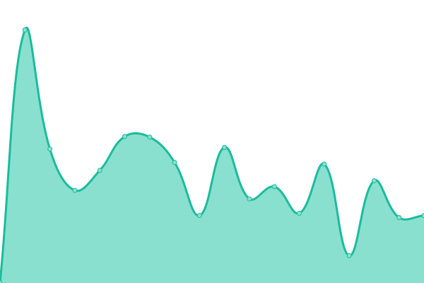
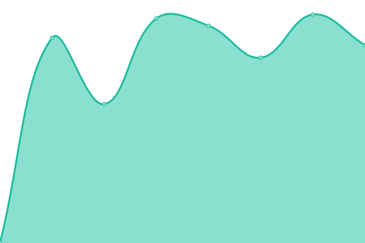
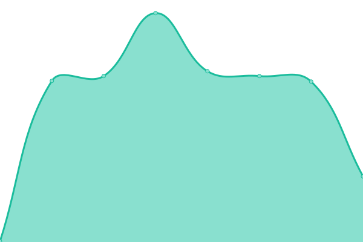

# [📈 Live Status](https://uptime.cemodding.wiki): <!--live status--> **🟩 All systems operational**

This repository contains the open-source uptime monitor and status page for [Idkman](https://uptime.cemodding.wiki), powered by [Upptime](https://github.com/upptime/upptime).

With [Upptime](https://upptime.js.org), you can get your own unlimited and free uptime monitor and status page, powered entirely by a GitHub repository. We use [Issues](https://github.com/Unrealdkman/cemodding-wiki-uptime/issues) as incident reports, [Actions](https://github.com/Unrealdkman/cemodding-wiki-uptime/actions) as uptime monitors, and [Pages](https://uptime.cemodding.wiki) for the status page.

<!--start: status pages-->
<!-- This summary is generated by Upptime (https://github.com/upptime/upptime) -->
<!-- Do not edit this manually, your changes will be overwritten -->
<!-- prettier-ignore -->
| URL | Status | History | Response Time | Uptime |
| --- | ------ | ------- | ------------- | ------ |
|  [Chrome Engine Modding Wiki](https://www.cemodding.wiki) | 🟩 Up | [chrome-engine-modding-wiki.yml](https://github.com/Unrealdkman/cemodding-wiki-uptime/commits/HEAD/history/chrome-engine-modding-wiki.yml) | 

 1199ms
     
 | 

<a href="https://uptime.cemodding.wiki/history/chrome-engine-modding-wiki">99.15%</a>
    

|  [Email provider](https://mail.privateemail.com) | 🟩 Up | [email-provider.yml](https://github.com/Unrealdkman/cemodding-wiki-uptime/commits/HEAD/history/email-provider.yml) | 

 576ms
     
 | 

<a href="https://uptime.cemodding.wiki/history/email-provider">100.00%</a>
    

|  [Pilgrimoutpost](https://pilgrimoutpost.techlandgg.com) | 🟩 Up | [pilgrimoutpost.yml](https://github.com/Unrealdkman/cemodding-wiki-uptime/commits/HEAD/history/pilgrimoutpost.yml) | 

 1033ms
     
 | 

<a href="https://uptime.cemodding.wiki/history/pilgrimoutpost">100.00%</a>
    

|  [Modio](https://mod.io) | 🟩 Up | [modio.yml](https://github.com/Unrealdkman/cemodding-wiki-uptime/commits/HEAD/history/modio.yml) | 

 251ms
     
 | 

<a href="https://uptime.cemodding.wiki/history/modio">100.00%</a>
    

<!--end: status pages-->

[**Visit our status website →**](https://uptime.cemodding.wiki)

## 📄 License

- Powered by: [Upptime](https://github.com/upptime/upptime)
- Code: [MIT](./LICENSE) © [Anand Chowdhary](https://anandchowdhary.com), supported by [Pabio](https://pabio.com)
- Data in the `./history` directory: [Open Database License](https://opendatacommons.org/licenses/odbl/1-0/)
